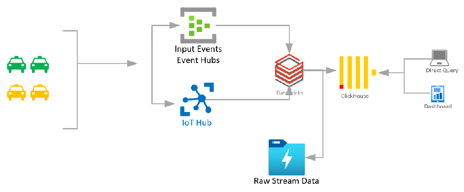

# Integrate Azure Databricks with - ClickHouse
Setting up connectivity between Spark and ClickHouse though trivial is a bit of tricky activity for beginner (Atleast I face some challanges). I could find resources available on internet that provides solution for batch. I tried putting a sample for inserting incoming streaming data into ClickHouse using Spark Structured Streaming   
## **Quick Recap on Azure Databricks & ClickHouse**
 &nbsp; 

**Azure Databricks** is a fast easy collaborative Apache Spark based platform for advance analytics.

**ClickHouse** is a blazingly fast, fault tolenrant, easy to use, open-source columninar OLAP storage

## Sample Architecture
I will be using part of the following architecture - </br>

1. Sensors - Simulated using script that generates the taxi fare JSON
2. EventHubs will receive the messages streamed by the script
3. Azure Databricks streaming Job will receive the messages and perform following tasks - 
    1. Store raw events in ADLS Gen2
    2. Performs cleansing, standardization and store required fields in ClickHouse table  
   
**How is the artifacts arranged** - 
1. Simulation script is a java code present in src/main/java. built jars are available in dist
2. Databricks Streaming job is a DBC archive that can be imported into Databricks workspace
3. ClickHouse sample Table creation script is present in scripts / sql

## Setup Instructions -

**Prerequisites -**
 
1. JDK 1.8 or higher 
2. Azure EventHubs Namespace and eventhub is created
3. Azure Datbricks workspace is created
4. Virtual Machine for ClickHouse installation choose any small VM sku I have selected D2s v3(2 Core 8 GB spot instance to save cost) Ubuntu VM
5. Clone / Download this repository
6. Download ClickHouse JDBC Driver 
 
**Install ClickHouse -** 

1. ClickHouse can be installed as a debian package or using container. I will use the debian package 
Connect to ubuntu VM via putty or any SSH tool of your choice and execute following command
pls refer ClickHouse [installation](https://clickhouse.tech/#quick-start)

```
sudo apt-get install apt-transport-https ca-certificates dirmngr
sudo apt-key adv --keyserver hkp://keyserver.ubuntu.com:80 --recv E0C56BD4

sudo apt-get update

sudo apt-get install -y clickhouse-server clickhouse-client

# Start ClickHouse Server
sudo service clickhouse-server start
# Start ClickHouse Client
clickhouse-client

```
2. Create Table - 
   Please refer [Table Types](https://clickhouse.tech/docs/en/engines/table-engines/#table_engines) <br/> 
    for this quickstart I am going to use StripeLog table type a simple data store that allows parallel data read <br/>
```
CREATE TABLE taxi_demo.taxi_fare
(
	pickup_datetime String,
	passenger_count String,
	rate_code_id String,
	pickup_locn_id String,
	dropoff_locn_id String,
	fare_amount String,
	tip_amount String
)
ENGINE = StripeLog 

```
3. Open Ports - Depending on which driver is used you need to open 9093 or 8123 inbound port of your VM (Navigate to your new VM on azure portal--> Networking --> Add inbound port rule) 

**Setup Sensor Simulation Code -**
Navigate to dist or setup java code in src/main/java into IDE of your choice and use maven build command

**Setup Databicks Cluster and Notebook -**

1. Create a Databricks spark 3 cluster with 1 driver and 1 master node you may choose 4 Core 14 GB machine
2. Deploy clickhouse JDBC driver from maven com.github.housepower:clickhouse-integration-spark_2.12:2.5.4
3. Deploy eventhub library - com.microsoft.azure:azure-eventhubs-spark_2.12:2.3.18
5. Make use of the dbc archive present in the dbc folder and import it into Azure Databricks workspace
6. Replace following parameters with he ClickHouse instance details you created
* serverName - Name of ClickHouse server / IP Address
* database - Name of the database created in ClickHouse
* port - default 9000
* username
* password              

Run all commands except cmd4 & cmd5

**Running Simulation**

Open send script (windows version) and replace EVENT_HUB_NAMESPACE,EVENT_HUB_NAME,SaSKeyName,SaSKey with your eventhub settings.
From command prompt navigate to scripts folder and execute send script. e.g. if you have copied the project in c:/ud/ADB-ClickHouse then navigate to scripts folder and run send script

Query on ClickHouse table using click-house client will show the records just inserted by streaming job

 
Contributors - <br/>
**Praveen Chandrasekharan** <br/>
**R K Iyer**

 
